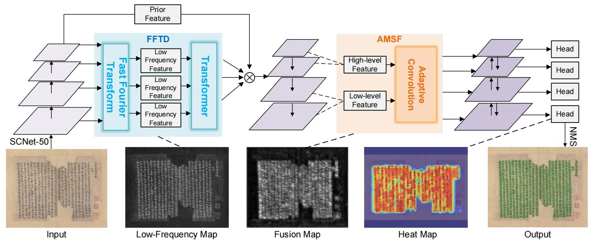
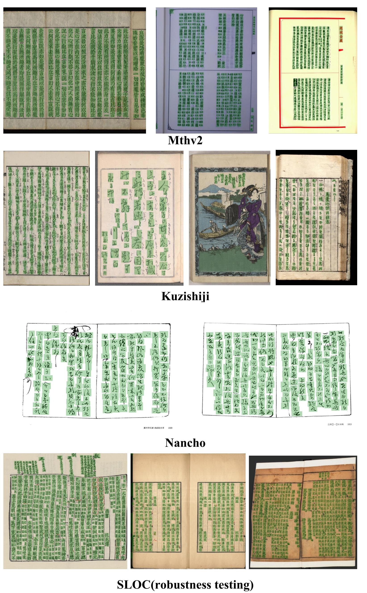

# E-FCOS: Enhanced Historical Text Detection with Fast Fourier Transform Denoising and Adaptive Multi-scale Fusion

## Description
This repository contains the official implementation of our paper **E-FCOS: Enhanced Historical Text Detection with Fast Fourier Transform Denoising and Adaptive Multi-scale Fusion**, have been accepted at ICDAR 2025✅.

---

## Model Architecture



---

## Prerequisites
- OS: Linux (Ubuntu) or Windows  
- Python: >= 3.8  
- Hardware: NVIDIA GPU with CUDA and CuDNN installed  

---

## Dataset and Patch Preparation

You can download the datasets used in the paper from the following links.  
Use the provided utility toolkit to extract image patches, edge maps, and mask maps to prepare your training data.

### Datasets referenced in this paper:
- [MTHv2 Dataset](https://github.com/HCIILAB/MTHv2_Datasets_Release)  
- [Kuzushiji Dataset](https://codh.rois.ac.jp/char-shape/)  
- [Nancho Dataset](https://drive.google.com/file/d/1iFB-9zEtmB3bjbO77gTKIkTLhdSEeBFD/view)  
- [SLOC Dataset](https://aistudio.baidu.com/datasetdetail/234851)  

---

## Usage

### Train the model on a dataset

```bash
python3 train.py
```
### Test the model on a dataset

```bash
python3 test.py
```
### Get detection results

```bash
python3 predict.py
```
---
## Visualization

